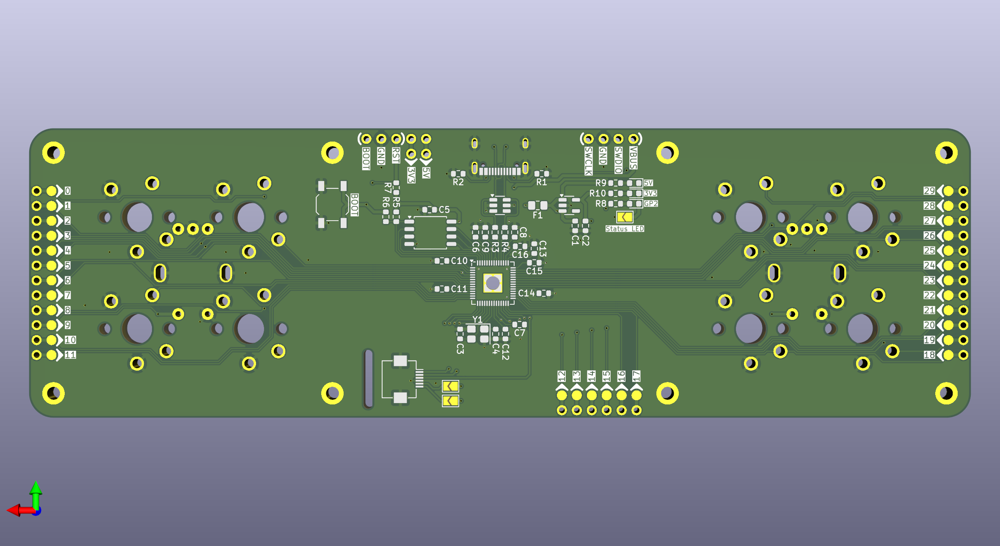

# Probetab8

|||
|--|--|
|||

## 說明

Probetab8是一把在設計途中不斷地向Google Gemini諮詢電路學知識的一把迷你鍵盤，是我用來進一步地學習電路學的一個巨大突破的成果。

這把鍵盤有以下幾個特點：
1. 晶片核心爲RP2040，全引腳輸出。
2. 可以燒錄RP2040 Debug Probe官方的韌體。
3. 可以按照我設計的佈局設置需要的功能：4+4顆按鍵、4按鍵+1旋鈕、2旋鈕。
4. 搭載Azoteq TPS65觸控板。
5. QMK/VIAL韌體。

## 使用材料

|||
|--|--|

### 電子元件

|類型|名稱|數量|封裝|備註|Reference|
|--|--|--|--|--|--|
|MCU|RP2040|1|QFN-56|-|U3|
|ESD|SRV05-4|1|SOT-23-6|-|U1|
|LDO|RT9013-33GB|1|SOT-23-5|-|U2|
|QSPI|W25Q128JVS|1|SOIC-8|-|U4|
|Resonator|Crystal|1|SMD-3225-4Pin|-|Y1|
|Receptacle|USB-C|1|-|16Pin|-|
|Fuse|6V, 500mA|1|0805|-|F1|
|SW|-|1|SPST_TL3342|BOOT||
|Capacitor|1uF|4|0603|-|C1, C2, C8, C16|
|Capacitor|15pF|2|0603|-|C3, C4|
|Capacitor|100nF|10|0603|-|C5-C7, C9-C15|
|Resistor|5.1K|2|0603|-|R1, R2|
|Resistor|27R|2|0603|-|R3, R4|
|Resistor|10K|2|0603|-|R5, R7|
|Resistor|1K|1|0603|-|R6|
|Resistor|470R|2|0603|-|R8, R9|
|Resistor|220R|1|0603|-|R10|
|Module|TPS65-201A-S|1|-|-|-|
|Cable|FFC-0.5mm|1|6Pin|L: 100mm|-|
|Socket|FFC-0.5mm|1|FH12-6S-0.5SH 6Pin|-|-|
|RED|LED|3|0603|After R8-10|-|

### 機構元件

|名稱|規格|數量|備註|
|--|--|--|--|
|Screw|M2x4mm|4|扁頭|
|Screw|M2x6mm|2|扁頭|
|Screw|M2x8mm|2|扁頭|
|Case|上蓋|1|-|
|Case|下蓋|1|-|
|Feets|8x1mm|4|矽膠腳貼|

### 自由選擇

|名稱|規格|數量|備註|
|按鍵|Choc v1, GLP1.0-2.0|0-8|-|
|鍵帽|Choc v1, MX stem for LP|0-8|-|
|編碼器|EC-11|0-2|L: 10mm、A: 5.5-5.0mm, 半軸 D型|

## 注意事項

- 不提供CSV給大家使用，如果需要PCBA，請自行修改PCB檔案。因爲這把鍵盤屬於純手工焊接，挑戰自己的焊接技巧，成果就是你的。
- 外殼上蓋有分4種，分別應對自由選擇的元件使用，底殼通用。
- 外殼檔案及PCB檔案都開放給大家，要修正改造請按照開源相關規定，我就不再說明了。 
- 焊接的時候，特別注意預熱、加熱相關的技巧及熟悉度，以免燒壞MCU或是燙傷；還有注意環境通風。
- 關於Jumper：

    - Status LED：測試燈開關，測試沒問題顆移除。
    - TPS65模組：RDY及RST，有使用這兩個引腳再焊接。

## 軟體工具

- Fusion。
- KiCAD 9.0.2。
- VScode。
- QMK、VIAL。
- Resberry官方Debug Probe韌體。

## 硬體工具

- TS-100、TS-101。
- MPH-30。
- FDM列印機。
- 萬用電表。